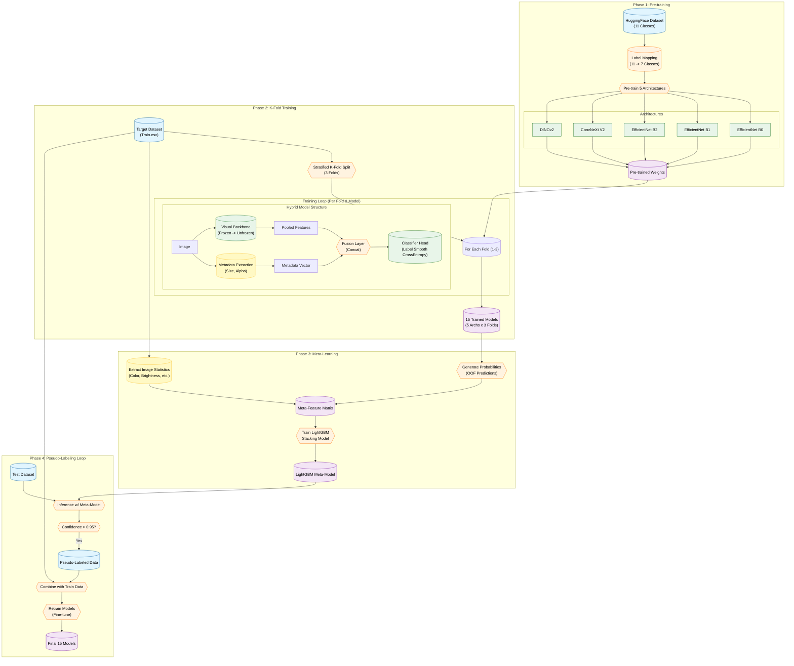
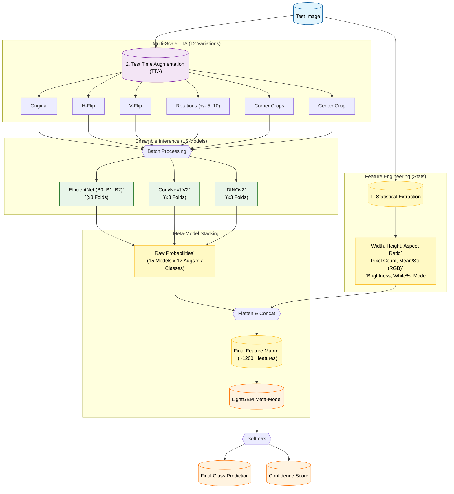

# Emoji Classification - Kaggle Competition

This project focuses on fine-tuning state-of-the-art vision models for emoji classification. It employs a sophisticated multi-stage pipeline involving transfer learning, hybrid model architectures, k-fold ensembling, and meta-learning stacking.

## Project Architecture

The project follows a 4-phase training strategy and a robust inference pipeline, as detailed in the architectural schemas.

### 1. Training Pipeline

The training process is divided into four distinct phases:

* **Phase 1: Pre-training**: Leveraging external HuggingFace datasets to pre-train five different architectures (EfficientNet B0/B1/B2, ConvNeXt V2, and DINOv2) on a mapped set of labels.
* **Phase 2: K-Fold Training**: Implementing a stratified 3-fold split on the target dataset. The models use a **Hybrid Architecture** that combines visual features from a backbone with image metadata (size, alpha channel presence).
* **Phase 3: Meta-Learning**: Generating Out-Of-Fold (OOF) predictions and extracting image statistics (color, brightness, etc.) to train a **LightGBM Stacking Model**.
* **Phase 4: Pseudo-Labeling**: Using the meta-model to predict labels for the test set, filtering for high-confidence predictions (>0.95), and re-training the ensemble with the combined dataset.

### 2. Inference Pipeline

A robust inference flow ensures maximum accuracy:

* **Multi-Scale TTA**: 12 variations per image including flips, rotations, and various crops.
* **Ensemble Inference**: Averaging predictions from 15 trained models (5 architectures × 3 folds).
* **Feature Engineering**: Injecting statistical features (Width, Height, RGB mean/std, Brightness, etc.) into the final stacking layer.
* **Meta-Model Stacking**: A final LightGBM model processes the concatenated model probabilities and statistical features for the final prediction.

## Tech Stack

* **Deep Learning**: PyTorch, Torchvision, HuggingFace Transformers, Accelerate
* **Machine Learning**: Scikit-learn, LightGBM, XGBoost
* **Data Processing**: Pandas, NumPy, Pillow, Datasets
* **Visualization**: Matplotlib, Seaborn
* **Utilities**: Kagglehub, tqdm

## Project Structure

* `finetune_swin_emoji_V*.ipynb`: Iterative development notebooks (V1 to V17).
* `V16_Architecture_Schemas.md`: Detailed Mermaid diagrams of the V16 architecture.
* `translator.py`: Utility script for CSV label normalization.
* `visualisations.ipynb`: Notebook for data exploration and result visualization.
* `requirements.txt`: Environment dependencies.
* `data/`: Directory containing training and testing datasets.

## Key Features

* **Hybrid Models**: Integration of visual backbones with metadata features.
* **Cross-Architecture Ensemble**: Combining CNNs (EfficientNet) with Transformers (Swin, DINOv2, ConvNeXt).
* **Advanced Data Augmentation**: Including Test Time Augmentation (TTA) for robust inference.
* **Stacking Generalization**: Using LightGBM as a meta-classifier to learn how to best combine base model predictions.
* **Semi-Supervised Learning**: Improving performance through iterative pseudo-labeling.

## Getting Started

1. **Install dependencies**:
   ```bash
   pip install -r requirements.txt --upgrade
   ```
2. **Run Notebooks**: Start with `finetune_swin_emoji_V16.ipynb` for the most efficient implementation.

## Zoom on V16 Approach

### V16 Training Approach & Architecture

This schema outlines the comprehensive training strategy implemented in `finetune_swin_emoji_V16.ipynb`. It highlights the **Hybrid Architecture** (combining visual backbones with metadata), the **Transfer Learning** flow (HuggingFace $\to$ Target), **Ensembling** (K-Fold), and **Semi-Supervised Learning** (Pseudo-labeling).



### Final Inference Pipeline

This schema details the flow of a single test image through the complex inference pipeline, including **Multi-Scale Test Time Augmentation (TTA)**, **Feature Engineering**, and the **Stacking Ensemble**.


